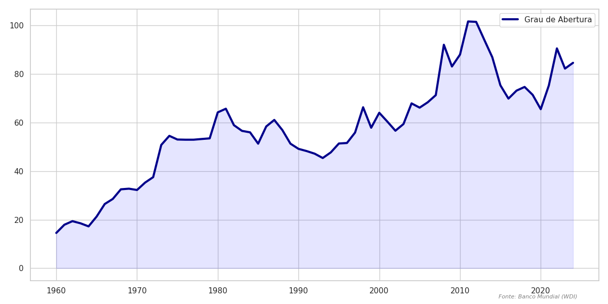

---
header-includes:
  - \usepackage{float}
  - \let\origfigure\figure
  - \let\endorigfigure\endfigure
  - \renewenvironment{figure}[1][2]{\origfigure[H]}{\endorigfigure}
---

# Impactos Econômicos das Crises na Coreia do Sul (Item 3)

## Introdução Geral
A trajetória econômica da Coreia do Sul é marcada por uma transição acelerada de uma economia agrária para uma potência tecnológica global. Esta evolução foi testada por choques profundos, que serviram como catalisadores para reformas institucionais e reestruturações do seu modelo produtivo. A análise a seguir detalha os impactos das crises do Petróleo (1970/80), a Crise Financeira Global (2008), a Pandemia de COVID-19 (2020) e o cenário inflacionário atual. Utilizando o arcabouço teórico de Carlin & Soskice, mapeamos como a coordenação entre o Banco da Coreia, o Governo e os grandes conglomerados (Chaebols) permitiu ao país manter sua resiliência exportadora e estabilidade macroeconômica ao longo de cinco décadas.

---

## 1. As Crises do Petróleo e a Consolidação do "Korea Inc." (1970-1985)

### Contexto Histórico e Estrutural
Na década de 1970, a Coreia do Sul implementou o ambicioso plano de **Industrialização Pesada e Química (HCI Drive)**. Este modelo baseava-se em uma coordenação estreita entre o Estado e os grandes conglomerados (**Chaebols**), com o governo direcionando crédito barato ("Policy Loans") para setores estratégicos.

### Impactos Econômicos e Mecânica dos Choques
O aumento dos preços do petróleo em 1973 e 1979 representou um **choque de oferta negativo clássico**, afetando o lado da produção.

*   **Curva PC:** O aumento dos custos de insumos importados deslocou a **Curva de Phillips (PC) para cima**. Isso é visível no salto da inflação para **29,2% em 1974**.
*   **Curva ERU/PS:** O custo energético reduziu a margem de lucro das empresas, deslocando a curva **PS para baixo**. Como consequência, o equilíbrio no mercado de trabalho ocorre em um nível de produto menor, movendo a **ERU para a esquerda**.
*   **Resultado:** O produto potencial sustentável ($y_e$) foi reduzido, gerando estagflação severa. O PIB real caiu em 1980 pela primeira vez na história moderna (-1,5%).

{width=80%}

{width=80%}

### Resposta de Política e Estabilização
*   **Ação Governamental (Fiscal):** O governo manteve o investimento ($I$) alto via subsídios e crédito direcionado às **Chaebols**, segurando a curva **IS** à direita do novo equilíbrio para preservar a capacidade industrial.
*   **O Decreto de 3 de Agosto (1972):** Esta intervenção radical atuou na solvência das empresas, permitindo que a curva **PS** não colapsasse totalmente por falências em massa.
*   **Aparato Monetário (BC):** Após 1980, o Banco da Coreia (BoK) elevou os juros nominais para **21%** (Estado C), subindo pela **Regra Monetária (MR)** para quebrar a inércia inflacionária.

{width=85%}

---

## 2. A Crise Financeira Global e a Maturidade Exportadora (2007-2012)

### Contexto e o Choque de Demanda Externa
Em 2008, a Coreia do Sul já era uma economia desenvolvida e integrada às cadeias globais. O choque foi de **demanda externa**, afetando o coração da economia coreana: as exportações ($X$).

### Impactos Econômicos e Mecânica dos Choques
*   **Curva IS:** A queda nas exportações netas ($X$) deslocou a curva **IS severamente para a esquerda**. O impacto nas exportações mensais foi um recuo de 40%, abrindo um hiato de produto negativo profundo ($y < y_e$).
*   **Curva AD:** A queda na demanda mundial deslocou a curva **AD para baixo**. Em um regime de câmbio flutuante, o Won depreciou agressivamente, movendo a economia para a direita ao longo da curva **BT**, amortecendo o colapso.

{width=80%}

{width=80%}

### Resposta de Política e Estabilização
*   **Política Monetária (MR):** O Banco da Coreia desceu agressivamente pela **curva MR**, cortando juros nominais para **1,25%**.
*   **Política Fiscal (Governo):** O **Green New Deal (2009)** injetou **50 trilhões de KRW**, deslocando a curva **IS de volta para a direita** (Estado C).
*   **Ações Estratégicas com as Chaebols:** O governo permitiu que as **Chaebols** aproveitassem a depreciação do câmbio para ganhar mercado global de concorrentes em crise.

{width=85%}

---

## 3. A Pandemia COVID-19 e a Resiliência Tecnológica (2019-2024)

### Contexto e o Choque Misto
A pandemia representou um choque simultâneo de oferta (cadeias de suprimento) e demanda (isolamento doméstico).

### Impactos Econômicos e Mecânica dos Choques
*   **Curva IS:** O isolamento e a incerteza derrubaram o consumo das famílias, deslocando a curva **IS para a esquerda**.
*   **Curva PC:** A paralisia global e custos de frete deslocaram a curva **PC para cima**, elevando a inflação para **6,3% em 2022**.

{width=80%}

{width=80%}

### Resposta de Política e Estabilização
*   **Estratégia K-Bangyeok:** Evitou lockdowns profundos, mantendo a curva **PS estável**. O governo injetou recursos em auxílios emergenciais, deslocando a curva **IS de volta para a direita**.
*   **K-Chips Act:** Créditos fiscais para as Chaebols visando deslocar a **PS para cima** e a **ERU para a direita** estruturalmente.
*   **Política Monetária (MR):** O BoK elevou a taxa para **2,0% em 2023** para reancorar as expectativas na **Regra Monetária (MR)**.

{width=85%}

---

## 4. Quadro Atual e Novos Desafios (2022-2025)

### Contexto Pós-Pandemia e Inflação Global
Após a recuperação da pandemia, a Coreia enfrentou inflação importada e tensões geopolíticas (guerra dos semicondutores).

### Evidências dos Dados
*   **Pico Inflacionário:** A inflação coreana demonstrou resiliência, retornando à meta mais rápido que a média da **OCDE** devido à disciplina da **MR**.
*   **Sentimento Econômico:** O Índice de Confiança do Consumidor (CCI) e Empresarial (BCI) refletem o peso do alto endividamento das famílias frente aos juros elevados.

{width=85%}

{width=85%}

---

## Síntese Conclusiva

A Coreia do Sul evoluiu de um modelo de crescimento forçado nos anos 70 para uma economia de alta tecnologia resiliente. A chave do sucesso coreano reside na agilidade institucional para adaptar a política macroeconômica às mudanças globais, mantendo a competitividade de suas curvas **PS e ERU** através da inovação tecnológica constante e da coordenação Estado-Chaebol.

| Crise | Natureza do Choque | Resposta Principal | Papel do Estado/Chaebols |
| :--- | :--- | :--- | :--- |
| **Anos 70/80** | Oferta (Energia) | Juros Altos + Estabilização | Estado "Diretor" (HCI Drive) |
| **2008** | Demanda (Externa) | Câmbio Flexível + Fiscal | Estado "Facilitador" (Green Growth) |
| **2020** | Misto (Saúde/Global) | Integração Saúde + Inovação | Estado "Sócio" (K-New Deal) |
| **Atual (2022-25)** | Oferta/Geopolítica | Reancoragem + Diversificação | Soberania Digital (K-Chips Act) |

---
*Relatório de Macroeconomia (2026.1). Fontes: FRED, Banco Mundial (WDI), BoK, OCDE.*
